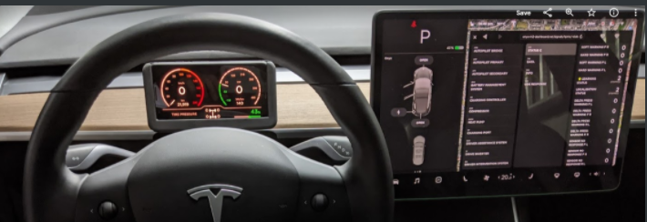

### Hi there 👋, I'm John

I have a day job as a software manager at [@dialoguemd](https://github.com/dialoguemd),
where we're building the premier Canadian tele-medicine platform (we probably have open
software development positions right now if that sounds like something you'd enjoy, see
[our career page](https://www.dialogue.co/en/careers) for details).

I also love working on hobbyist projects, most of which involve software in some way.
This is what you'll find here on GitHub, although to be honest, developing "in public"
is a pretty new thing for me. I really like cars and music, and many of my personal
projects are related to these.

### Current project: Onyx M2

An end-to-end solution for reading the CAN bus signals flying around in a Tesla Model 3
and do interesting things with them. These currently include browsing the signals in
real time on the car's main display while driving, and powering a custom 3d printed
instrument cluster that uses my phone.

<!--
### Previous projects and fun facts

**johnmccalla/johnmccalla** is a ✨ _special_ ✨ repository because its `README.md` (this file) appears on your GitHub profile.

Here are some ideas to get you started:

- 🔭 I’m currently working on ...
- 🌱 I’m currently learning ...
- 👯 I’m looking to collaborate on ...
- 🤔 I’m looking for help with ...
- 💬 Ask me about ...
- 📫 How to reach me: ...
- 😄 Pronouns: ...
- ⚡ Fun fact: ...
-->
